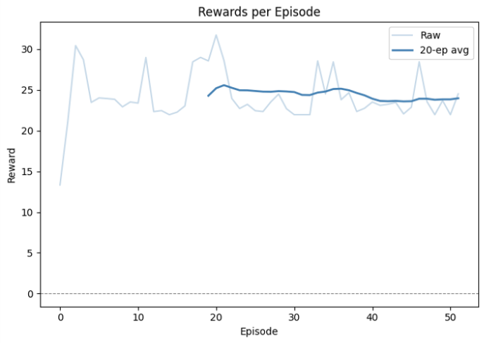
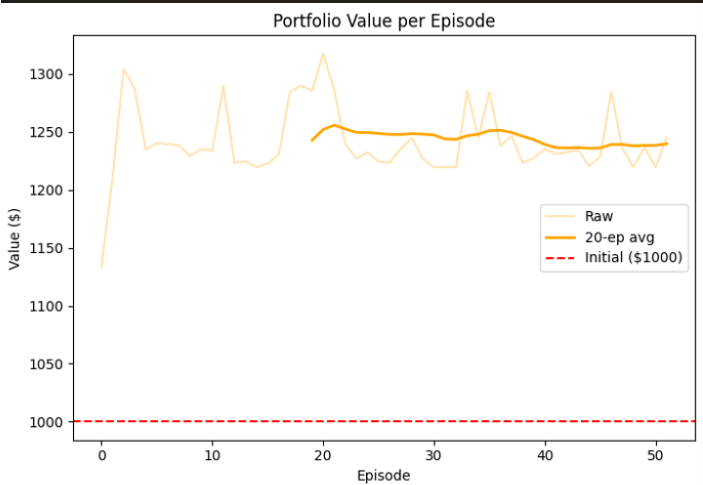

# 📈 Reinforcement Learning for Trading (Actor-Critic)

## 🧠 Overview
This project implements a reinforcement learning agent using an Actor-Critic architecture to simulate trading decisions in a simplified financial environment. The agent learns to buy, sell, or hold an asset based on price movements and portfolio state.

## 🎯 Problem Statement
The goal is to model sequential decision-making in trading, where an agent interacts with a dynamic price environment and learns policies that influence portfolio value over time.

## ⚙️ Approach

### Environment
- Simulated price series (synthetic data)
- Initial capital: 1000
- State representation:
  - Normalized asset price
  - Inventory (units held)

### Actions
- 0 → Hold  
- 1 → Buy  
- 2 → Sell  

### Portfolio Value
portfolio_value = cash + inventory * current_price

## 🧮 Reward Function
The agent is trained using step-wise portfolio changes:

reward = current_portfolio_value - previous_portfolio_value

- Provides immediate feedback for each action  
- Rewards are scaled to stabilize training  

## 🤖 Model Architecture
- Actor-Critic neural network  
- Shared feature layer  
- Actor outputs action probabilities  
- Critic estimates state value  

### Learning
advantage = target - value

- Actor optimized using policy gradients  
- Critic minimizes value estimation error  

## 📊 Results

### Reward per Episode

### Portfolio Value per Episode

### Observations
- Rewards vary across episodes, indicating learning behavior  
- Fluctuations occur due to stochastic price data and exploration  
- No stable profit strategy (expected in simplified setup)  

## 🛠 Tech Stack
- Python  
- PyTorch  
- NumPy  
- Matplotlib  

## 🚧 Limitations
- Uses synthetic price data (not real market data)  
- Very simple state representation  
- No transaction costs or slippage  
- No explicit risk modeling (CVaR not implemented)  

## 🔮 Future Work
- Use real financial time-series data  
- Add technical indicators  
- Implement risk-aware objectives (CVaR, drawdown constraints)  
- Try advanced RL algorithms (PPO, SAC)  

## ▶️ How to Run
pip install -r requirements.txt  
python trading_rl.py  

## 📌 Key Insight
This project demonstrates how reinforcement learning can be applied to financial decision-making, while highlighting challenges like reward design and training stability.
